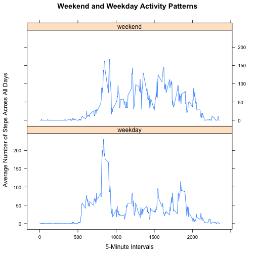

###Loading and Preprocessing the Data###

After setting the working directorty using the ```setwd()``` command, the following libraries were loaded:  


```r
library(dplyr)
library(tidyr)
library(ggplot2)
library(plyr)
library(timeDate)
library(lattice)
```
The data was loaded from the "activity.csv" file using the `read.csv()` command and the date variable was converted from factor to date using `as.Date()`. 


```r
data_tmp<-read.csv("activity.csv")
data_tmp$date <- as.Date(data_tmp$date)
```

We then must find the total number of steps taken by day intervals.


```r
data <- aggregate(data_tmp$steps , 
               list(date = cut(as.Date(data_tmp$date), 
                              breaks="1 day")), FUN=sum)
```

###What is the mean total number of steps taken per day?###
For this part of the report, we ignore the missing values in the dataset.  


```r
hist(data$x, main="Histogram of Total Number\n of Steps Taken per Day", 
     xlab="Steps Taken per Day",
     breaks = 20,
     xlim= c(0,25000),
     ylim= c(0,20))
```

 

The `summary()` command is used calculate the median and mean **total** number of steps taken per day (10,760 and 10,770 respectively). 

```r
summary(data$x)
```

```
##    Min. 1st Qu.  Median    Mean 3rd Qu.    Max.    NA's 
##      41    8841   10760   10770   13290   21190       8
```

###What is the average daily activity pattern?###
using the `aggregate()` command, we calculate the mean of steps for each interval.

```r
data_avg <- aggregate(steps~interval, data=data_tmp, FUN= "mean")
plot(data_avg$interval, data_avg$steps, type="l", 
     main="Average Daily Activity Pattern\nby 5-Minute Intervals", 
     xlab="5 Minute Invervals",
     ylab="Average Number of Steps Across All Days")
```

 

We use this funky looking command to determine which 5-minute interval average contains the maximum number of steps (835). 

```r
data_avg[which.max(data_avg$steps),]
```

```
##     interval    steps
## 104      835 206.1698
```

###Imputing Missing Values###
The total number of missing values calculated by variable (2304):

```r
summary(is.na(data_tmp))
```

```
##    steps            date          interval      
##  Mode :logical   Mode :logical   Mode :logical  
##  FALSE:15264     FALSE:17568     FALSE:17568    
##  TRUE :2304      NA's :0         NA's :0        
##  NA's :0
```
The mean for each 5-minute interval is used to fill missing values using the `ddply()` command and arranged on "date" and "interval".

```r
impute.mean <- function(x) replace(x, is.na(x), mean(x, na.rm = TRUE))
data_new <- ddply(data_tmp, ~ interval, transform, steps = impute.mean(steps))
data_new2 <- arrange(data_new, date, interval)
head(data_new2, 5)
```

```
##       steps       date interval
## 1 1.7169811 2012-10-01        0
## 2 0.3396226 2012-10-01        5
## 3 0.1320755 2012-10-01       10
## 4 0.1509434 2012-10-01       15
## 5 0.0754717 2012-10-01       20
```
As before, we must `aggregate()` the values of the new data set by day.

```r
data_new3 <- aggregate(data_new2$steps , 
                  list(date = cut(as.Date(data_new2$date), 
                                  breaks="1 day")), FUN=sum)
```
As we see from the histogram of the new data set, the frequency of the mean total daily steps is increased - since the mean of the 5-min intervals summed on a daily basis will be the mean of total daily steps.


```r
hist(data_new3$x,
     main="Histogram of Total Number\n of Steps Taken per Day", 
     xlab="Steps Taken per Day",
     breaks = 20,
     xlim= c(0,25000),
     ylim= c(0,20)
     )
```

 
  
  
Because of the imputed values, the mean stays the same, but the median changes (now both mean and median are 10,770).

```r
summary(data_new3$x)
```

```
##    Min. 1st Qu.  Median    Mean 3rd Qu.    Max. 
##      41    9819   10770   10770   12810   21190
```

###Differences in Activity between Weekdays and Weekends###
There is likely a more elegant way of processing the data, but I decided to separate the weekday intervals from the weekend intervals, process each in turn, and then combine them again to plot the comparison on lattice. 

**Separating Weekdays from Weekends**  
  

Using the `mutate()` command in combination with `isWeekday()` from the `tableDate` library on the new dataset, I separate each interval into two groups:

```r
data_new5 <- mutate(data_new2, weekday=isWeekday(date))
data_wkdy <- filter(data_new5, weekday==TRUE)
data_wknd <- filter(data_new5, weekday==FALSE)
head(data_wkdy, 5)
```

```
##       steps       date interval weekday
## 1 1.7169811 2012-10-01        0    TRUE
## 2 0.3396226 2012-10-01        5    TRUE
## 3 0.1320755 2012-10-01       10    TRUE
## 4 0.1509434 2012-10-01       15    TRUE
## 5 0.0754717 2012-10-01       20    TRUE
```

```r
head(data_wknd, 5)
```

```
##   steps       date interval weekday
## 1     0 2012-10-06        0   FALSE
## 2     0 2012-10-06        5   FALSE
## 3     0 2012-10-06       10   FALSE
## 4     0 2012-10-06       15   FALSE
## 5     0 2012-10-06       20   FALSE
```

**Calculating Means Over Intervals for Each Group**  
  
The `aggregate()` command is used, as before, to determine the average over the relevant time period for each interval. 


```r
data_wk_avg <- aggregate(steps~interval, data=data_wkdy, FUN= "mean")
data_wknd_avg <- aggregate(steps~interval, data=data_wknd, FUN= "mean")
```

**Final Processing for Lattice Plot**  
  
My data is ready to be plotted and compared, but, first I will need to label each interval with the appropriate designation "weekday/weekend" and transform the designations into a 2-level factor variable "daytype"

```r
data_wk_avg2 <- mutate(data_wk_avg, daytype="weekday")
data_wknd_avg2 <-mutate(data_wknd_avg, daytype="weekend")
mergedData <- rbind(data_wknd_avg2, data_wk_avg2)
mergedData <- transform(mergedData, daytype = factor(daytype))
head(mergedData, 5)
```

```
##   interval       steps daytype
## 1        0 0.214622642 weekend
## 2        5 0.042452830 weekend
## 3       10 0.016509434 weekend
## 4       15 0.018867925 weekend
## 5       20 0.009433962 weekend
```

We are now ready to plot using the lattice system (compare with assignment Github [Readme](https://github.com/mastreips/RepData_PeerAssessment1))


```r
xyplot(steps ~ interval | daytype, data= mergedData, layout = c(1,2), type="l",
       main="Weekend and Weekday Activity Patterns",
       xlab = "5-Minute Intervals",
       ylab= "Average Number of Steps Across All Days")
```

 
